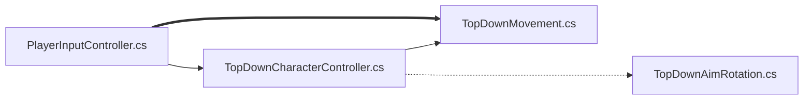

# 20240314TopDown

---
#0318


[](https://s8st.github.io/20240314TopDown/)  

```
[](링크 연결 주소)
[](https://s8st.github.io/20240314TopDown/)
```


https://github.com/s8st/20240314TopDown/assets/153998744/cde06944-5505-49d6-b277-461ea2101a51


---
> # 20240314




PlayerInputController.cs  
TopDownMovement.cs  
TopDownCharacterController.cs  
TopDownAimRotation.cs  


---
  

Look에 mousePosition추가해야 `TopDownAimRotation.cs`에서 ` public void OnAim(Vector2 newAimDirection)
 {
     RotateArm(newAimDirection);
 }` 작동

---
