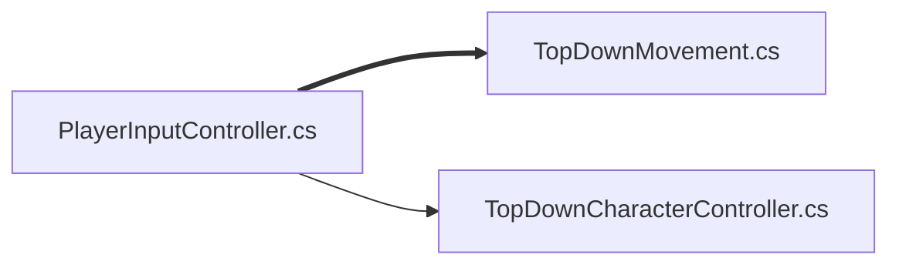

# 20240314TopDown

---  

> # 20240314

```mermaid
%% TD : topdown, LR : left right%%
graph LR;  
    PlayerInputController.cs==>TopDownMovement.cs;
    PlayerInputController.cs-->TopDownCharacterController.cs;
    
```

PlayerInputController.cs
TopDownMovement.cs
TopDownCharacterController.cs

---
