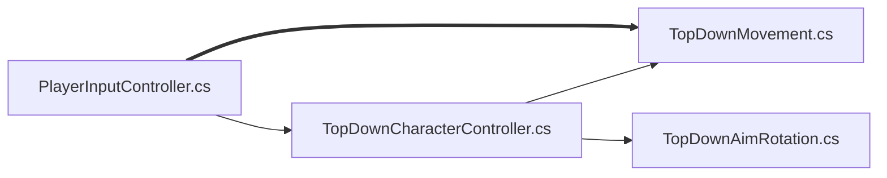

# 20240314TopDown

---  

> # 20240314

PlayerInputController.cs  
TopDownMovement.cs  
TopDownCharacterController.cs  
TopDownAimRotation.cs  

---
  

Look에 mousePosition추가해야 `TopDownAimRotation.cs`에서 ` public void OnAim(Vector2 newAimDirection)
 {
     RotateArm(newAimDirection);
 }` 작동

---
