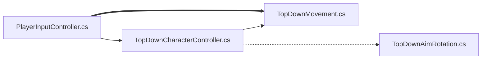

# 20240314TopDown
---  

# 0320  
- 클래스 다이어그램 만들어보기
  - 우선 움직임에 대한 스크립트부터
- CharacterStatsHandler.cs 다시 살펴보기
- 모바일에 적용할 이동 공격 버튼 찾아서 적용 해보기
  - ---> 인풋시스템을 디폴트로 하고 터치 액션만 테스트 해보기


---
#0319  

- 조이스틱 달기 --> 모바일에서 사용할 수 있게 
  -   ---> 조이스틱 만들기는 가능한데 조준이 안되는 문제
- https://www.youtube.com/watch?v=O5Qvq4dypOg&list=PLO-mt5Iu5TeZF8xMHqtT_DhAPKmjF6i3x&index=22
- 스크립트 목록 정리하기
- 폴더에 넣고 연결하기
- 클래스 다이어그램 만들어 보기

`깃허브 프로젝트 만들기 찾아보기`  

깃허브 헙업, 프로젝트 만들기 : 
https://www.youtube.com/watch?v=6sBNPvxjyt0  


---  


- 힐을 더 회복하게 만들어 준다  
```cs
  PickupHeal : PickupItem   
         _healthSystem = receiver.GetComponent<HealthSystem>();
        _healthSystem.ChangeHealth(healValue);
   ``` 

- OnPickedUp구현하고 아이템을 먹으면 stat에 설정된 만큼 추가  
```cs
PickupStatModifiers : PickupItem
{
    [SerializeField] private List<CharacterStats> statsModifier;
    protected override void OnPickedUp(GameObject receiver)
    {
        CharacterStatsHandler statsHandler = receiver.GetComponent<CharacterStatsHandler>();
        foreach (CharacterStats stat in statsModifier)
        {
            statsHandler.AddStatModifier(stat);
  ```   

- 먹을 수 있는 아이템인지 검사, 집으면 삭제하고 소리나게 하고 파괴
  
       public abstract class PickupItem : MonoBehaviour  
       protected abstract void OnPickedUp(GameObject receiver);


- 소리 등록하고 재생하고 끄기
```cs
  
       public class SoundSource : MonoBehaviour
       public void Play(AudioClip clip, float soundEffectVolume, float soundEffectPitchVariance)
```   


- 배경음악 재생, 오브젝트풀로 만들기  
```  
public class SoundManager : MonoBehaviour
   
        ChangeBackGroundMusic(musicClip);
         public static void PlayClip(AudioClip clip)
   
```

- 걸을 때 에니메이션 이벤트에 연결하기, 발바닥에 먼지 파티클 효과
```
public class DustParticleControl : MonoBehaviour

    public void CreateDustParticles()

```


- 죽으면 벡터 제로, 투명도를 30%, 2초후 삭제
```
public class DisappearOnDeath : MonoBehaviour

    void OnDeath()
```    


- 데미지 받을때 오디오클립 재생, 힐 받으면 체력 증가, 데미지 받으면 체력 감소,체력 0이면 OnDeath
```
public class HealthSystem : MonoBehaviour

    public bool ChangeHealth(float change)
        private void CallDeath()
  

```


- 원거리 공격 몬스터의 공격 판단 
```
public class TopDownRangeEnemyContreoller : TopDownEnemyController

    protected override void FixedUpdate()
```


- 근접 몬스터 공격 판단, 공격받으면 추격거리를 100으로 확장, 공격할 때 넉백 적용
```
public class TopDownContactEnemyController : TopDownEnemyController

    private void OnDamage()
  

    protected override void FixedUpdate()
 

    private void Rotate(Vector2 direction)
   

    private void OnTriggerEnter2D(Collider2D collision)
      
    // 충돌 여부 체크
    private void OnTriggerExit2D(Collider2D collision)
   
    // 넉백 적용	
    private void ApplyHealthChange()
   
```


- 코루틴으로  몬스터 발생시키기, 웨이브 증가, 몬스터 랜덤 업그레이드, 아이템 보상 생성
- 체력UI,게임오버,업데이트웨이브UI,다시시작하기,게임 나가기
```
public class GameManager : MonoBehaviour

       UpgradeStatInit();
       StartCoroutine("StartNextWave"); 
        
    IEnumerator StartNextWave()
   
    private void OnEnemyDeath()
   
    private void UpdateHealthUI()
    

    private void GameOver()
  
    private void UpdateWaveUI()
   
    public void RestartGame()
  
    public void ExitGame()
   
    void CreateReward()
 
    //스탯 초기화
    void UpgradeStatInit()
  
    void RandomUpgrade()
```   
        


- 거리와 방향 계산  
```
public class TopDownEnemyController : TopDownCharacterController
   
    protected float DistanceToTarget()
     protected Vector2 DirectionToTarget()
```  


- 애니메이션 설정 : 걷기,공격,피격 시 에니메이터의 값 조정
```
public class TopDownAnimationController : TopDownAnimations

    private void Move(Vector2 obj)
   
    private void Attacking(AttackSO obj)
    
    private void Hit()
  

    private void InvincibilityEnd()
 ```


- TopDownAnimationController 에서 상속받아서 사용
```
public class TopDownAnimations : MonoBehaviour

         animator = GetComponentInChildren<Animator>();
        controller = GetComponent<TopDownCharacterController>();
    
```


- 구조체 Pool의 필드를 가지는 Dictionary<string, Queue<GameObject>>를 계속 생성시키기
```
public class ObjectPool : MonoBehaviour
{
   
    public struct Pool
 
    public GameObject SpawnFromPool(string tag)
  
```


- 델리게이트로 이동, 보는 방향, 공격 연결
```
public class TopDownCharacterController : MonoBehaviour
 
        HandleAttackDelay();
 
    
    public void CallMoveEvent(Vector2 direction)
  

    public void CallLookEvent(Vector2 direction)
  

    public void CallAttackEvent(AttackSO attackSO)
   
```


- 원거리 공격시 발사체의 충돌과 삭제,데미지로 체력 깎기,발사체의 색, 파티클 fx 통제
```
public class RangedAttackController : MonoBehaviour
   
    private void OnTriggerEnter2D(Collider2D collision)
  
            DestroyProjectile(collision.ClosestPoint(transform.position), fxOnDestory);
    
    public void InitializeAttack(Vector2 direction, RangedAttackData attackData, ProjectileManager projectileManager)
  

    private void UpdateProjectilSprite()
 
    private void DestroyProjectile(Vector3 position, bool createFx)
 
            _projectileManager.CreateImpactParticlesAtPostion(position, _attackData);
      
        gameObject.SetActive(false); 

```


- 발사체 사용 준비, 발사체 파티클이펙트
```
public class ProjectileManager : MonoBehaviour


    public void ShootBullet(Vector2 startPostiion, Vector2 direction, RangedAttackData attackData)

  
    public void CreateImpactParticlesAtPostion(Vector3 position, RangedAttackData attackData)
```


- **이건 다시 한번 강의를 참고하기**
```
public class CharacterStatsHandler : MonoBehaviour

    private void Awake()
    {
        UpdateCharacterStats();
    }

    public void AddStatModifier(CharacterStats statModifier)
    {
        statsModifiers.Add(statModifier);
        UpdateCharacterStats();
    }

    public void RemoveStatModifier(CharacterStats statModifier)
    {
        statsModifiers.Remove(statModifier);
        UpdateCharacterStats();
    }

    private void UpdateCharacterStats()
   
 
    private void UpdateStats(Func<float, float, float> operation, CharacterStats newModifier)
 

    private void UpdateAttackStats(Func<float, float, float> operation, AttackSO currentAttack, AttackSO newAttack)
 

    private void ApplyRangedStats(Func<float, float, float> operation, CharacterStats newModifier)
   

    private Color UpdateColor(Func<float, float, float> operation, Color currentColor, Color newColor)
  

    private void LimitStats(ref float stat, float minVal)
  

    private void LimitAllStats()

```


- 원거리 공격 데이터 + 일반 공격 데이터 상속  
```

[CreateAssetMenu(fileName = "RangedAttackData", menuName = "TopDownController/Attacks/Ranged", order = 1)]
public class RangedAttackData : AttackSO
```


- 일반 공격 데이터
```
[CreateAssetMenu(fileName = "DefaultAttackData", menuName = "TopDownController/Attacks/Default", order = 0)]
public class AttackSO : ScriptableObject

```


- 케릭터 스탯 설정 ---> CharacterStatsHandler ---> 플레이어에 스크립트 연결
```
public enum StatsChangeType {    Add,    Multiple,    Override,}

[Serializable]
public class CharacterStats

```

- 발사체 발사, 발사시 오디오클립 재생
```
public class TopDownShooting : MonoBehaviour

  

    private void OnShoot(AttackSO attackSO)


    private void CreateProjectile(RangedAttackData rangedAttackData, float angle)
  
            SoundManager.PlayClip(shootingClip);
 

```


- 마우스 방향으로 케릭터와 무기의 방향 전환
```
public class TopDownAimRotation : MonoBehaviour

    public void OnAim(Vector2 newAimDirection)
    {
        RotateArm(newAimDirection);
    }

    private void RotateArm(Vector2 direction)
 

```


- 플레이어 이동, 넉백  ---> PlayerInputController 
```
public class TopDownMovement : MonoBehaviour


    private void Move(Vector2 direction)
 
    public void ApplyKnockback(Transform other, float power, float duration)
  


    private void ApplyMovement(Vector2 direction)
   
```


- PlayerInput(키보드와 마우스 등의 입력) ---> PlayerInputController 
- 마우스와 키보드 입력 받는 스크립트 : 이동, 보는 방향, 발사
```
public class PlayerInputController : TopDownCharacterController

    public void OnMove(InputValue value)
   
        CallMoveEvent(moveInput);
  

    public void OnLook(InputValue value)
    
            CallLookEvent(newAim);
  
    public void OnFire(InputValue value)
         
        IsAttacking = value.isPressed;

```


---
#0318


[](https://s8st.github.io/20240314TopDown/)  

```
[](링크 연결 주소)
[](https://s8st.github.io/20240314TopDown/)
```


https://github.com/s8st/20240314TopDown/assets/153998744/cde06944-5505-49d6-b277-461ea2101a51


---
> # 20240314




PlayerInputController.cs  
TopDownMovement.cs  
TopDownCharacterController.cs  
TopDownAimRotation.cs  


---
  

Look에 mousePosition추가해야 `TopDownAimRotation.cs`에서 ` public void OnAim(Vector2 newAimDirection)
 {
     RotateArm(newAimDirection);
 }` 작동

---
